<div align="center">

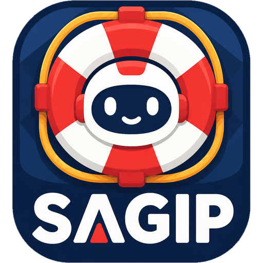

# SAGIP

### **S**mart **A**id & **G**uidance for **I**mmediate **P**reparedness

**An emergency assistant that runs a real LLM on your phone — so it still answers when the signal is gone.**

[](https://www.appbuildersph.com/hackathon/)
[](https://huggingface.co/litert-community/gemma-4-E2B-it-litert-lm)
[](https://ai.google.dev/edge/litert-lm)
[](#run-it-yourself-for-judges)
[](#what-runs-locally-vs-what-needs-internet)
[](#features)

<br/>

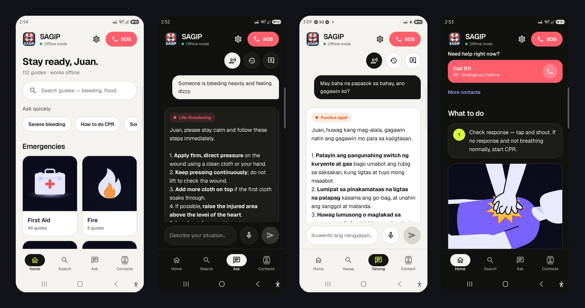

<sub>Real screenshots from a Samsung Galaxy S23 Ultra. The third phone is in **airplane mode** (✈ in the status bar) answering in Tagalog.</sub>

</div>

> **TL;DR for judges** — SAGIP is a native Android app that runs **Gemma 4 E2B on the phone GPU** (LiteRT-LM) over
> **112 offline, source-cited emergency guides in English + Tagalog**, personalised with a profile that never
> leaves the device. **No `INTERNET` permission.** Try it with airplane mode on: ask
> *"Someone is bleeding heavily and feeling dizzy"* · [run it yourself](#run-it-yourself-for-judges) ·
> [submission answers](docs/SUBMISSION.md) · [judge briefing](docs/JUDGE-BRIEFING.md)

---

## Why this exists

Typhoons, floods and earthquakes knock out cell towers in the Philippines every year — **exactly when people need
first-aid and evacuation guidance the most.** A cloud chatbot is a dead icon in that moment.

SAGIP puts the whole stack on the phone: the language model, 112 curated bilingual guides, your medical profile
and your emergency contact. Ask *"Someone is bleeding heavily and feeling dizzy"* with no signal and you get calm,
numbered steps, a severity tag and a named source, written for **you** (your name, allergies, household) in
English or Tagalog.

## Why does this product benefit from running AI locally?

1. **It works when the cloud doesn't.** Emergencies and network outages coincide. Local inference is the product,
   not an optimisation: with the model removed there is nothing left to use when the signal drops.
2. **Privacy for the most sensitive data you own.** Allergies, medications, conditions, blood type, home area and
   emergency contact feed the prompt on the device and never leave it. The app has **no `INTERNET` permission**.
3. **Latency and cost.** First word in about a second on the phone GPU, no per-request fee, no rate limits, no
   battery spent on a weak radio retrying a request.
4. **Safer grounding.** A small local model answering only from vetted, source-cited guides is more predictable
   than a large remote model improvising medical advice.

## Features

| | |
|---|---|
| 💬 **Ask** | A support-agent chat grounded in the offline guides. It addresses you by first name, adapts steps to your profile, handles follow-ups ("paano kung walang response?"), shows the matching illustration and related guides, and politely refuses off-topic requests. |
| 📚 **Browse & search** | 13 categories → **112 illustrated guides** (first aid, typhoon/flood, earthquake, fire, volcano, wildlife, survival…), searchable in English and Tagalog. |
| 🧑‍⚕️ **Personalised** | Onboarding captures allergies, conditions, medications, blood type, birthday, household (infant / elderly / PWD / pregnant) and an emergency contact. Ask *"what are my allergies and what should I avoid?"* and it answers from your profile. |
| 📞 **"Call my wife"** | Say it (or type it) and SAGIP places the call to your saved emergency contact. In disasters it also reminds you to check on family. Phone numbers are never generated by the model. |
| 🆘 **SOS & contacts** | One-tap SOS sheet; area-aware contact directory that follows your GPS and works offline (sample numbers are badged **Sample**). |
| 🎙️ **Voice** | Optional voice input with auto-send when you stop talking. |
| 🌗 **Polish** | Light / dark / system themes, English ⇄ Tagalog switch, local chat history, one-tap full reset, version label for builds. |

<div align="center">

<table>
<tr>
<td>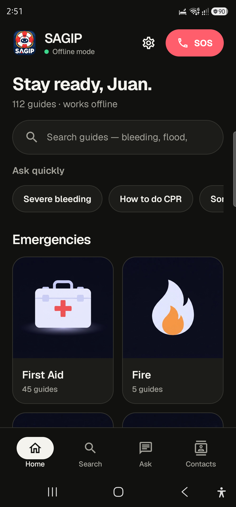</td>
<td>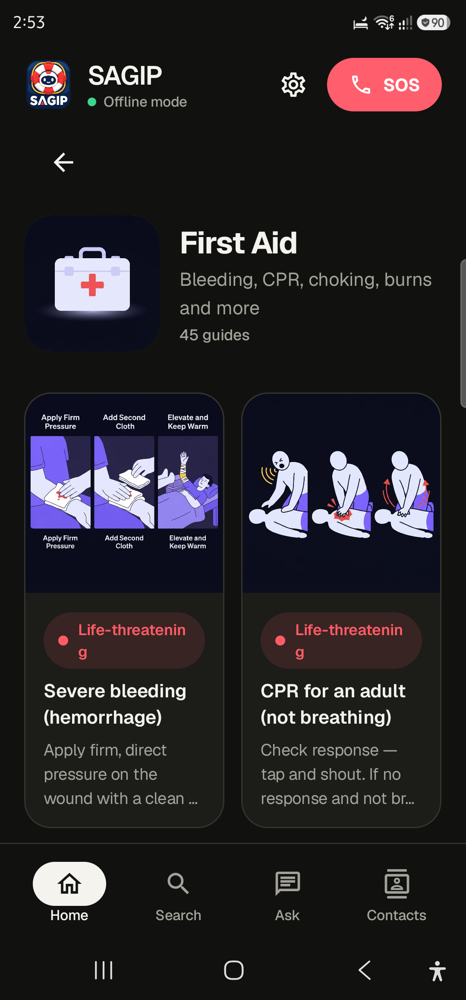</td>
<td>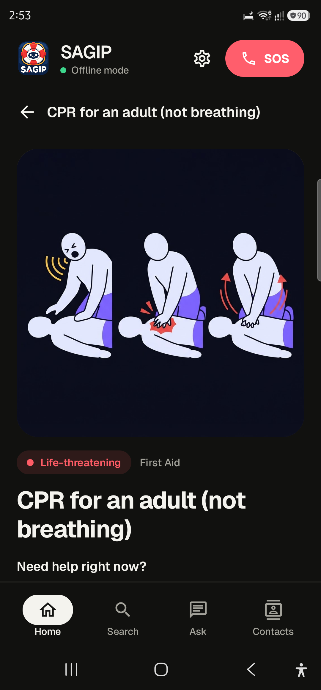</td>
<td>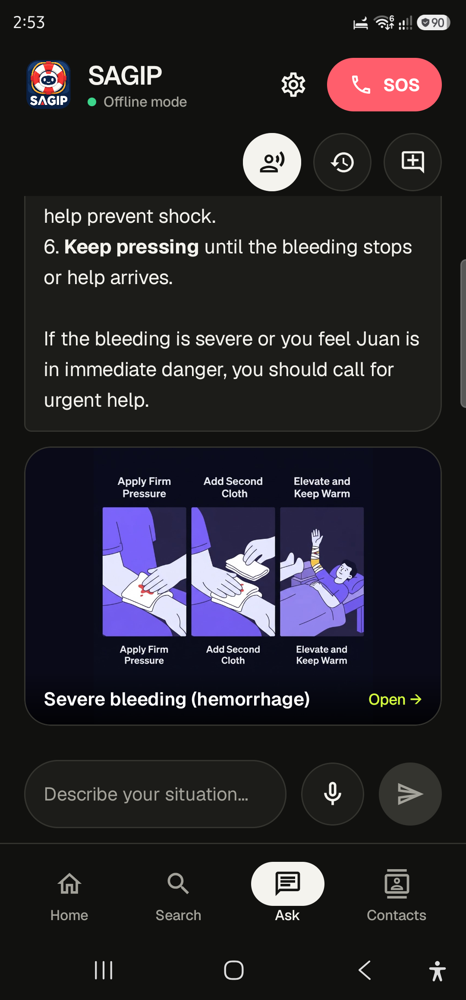</td>
</tr>
<tr>
<td align="center"><sub>Home</sub></td><td align="center"><sub>Category</sub></td><td align="center"><sub>Illustrated guide</sub></td><td align="center"><sub>Answer + guide art</sub></td>
</tr>
<tr>
<td>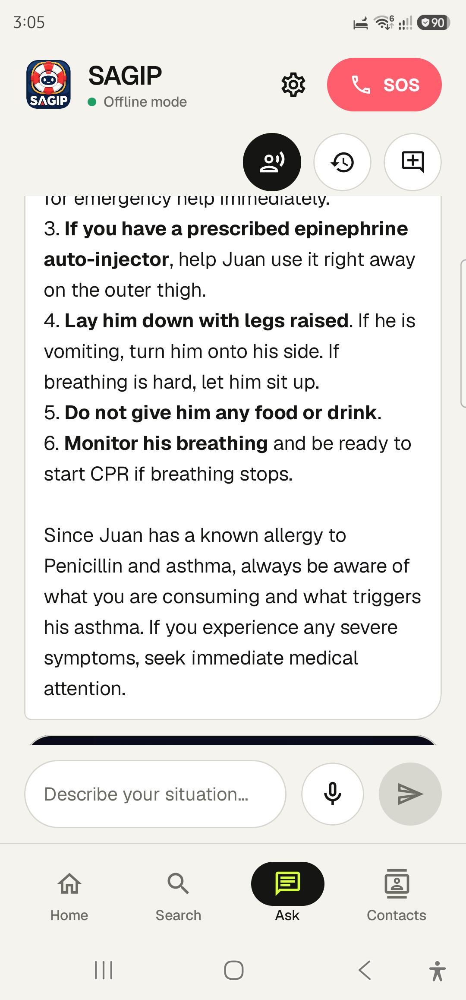</td>
<td>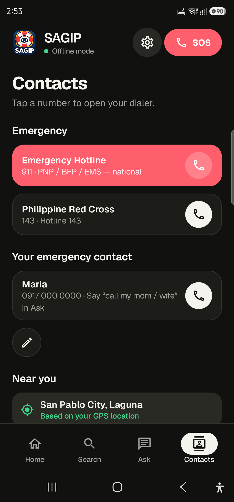</td>
<td>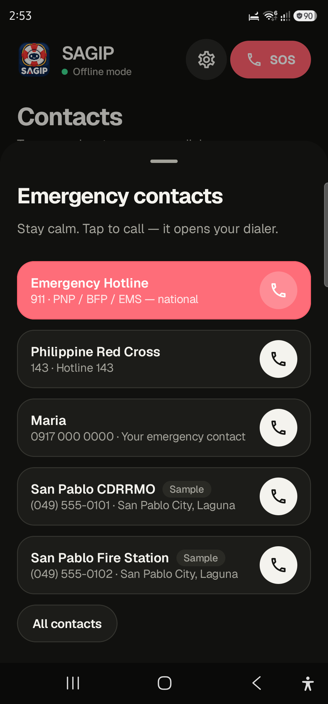</td>
<td>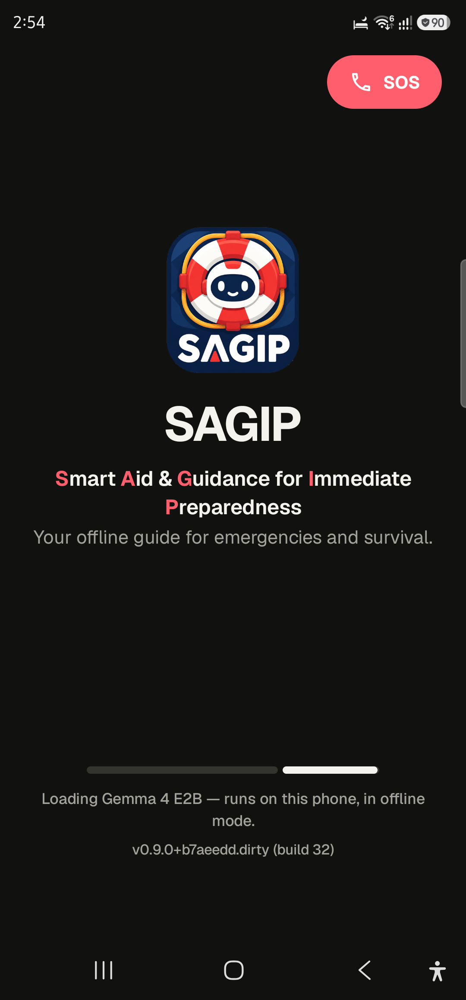</td>
</tr>
<tr>
<td align="center"><sub>Uses your profile</sub></td><td align="center"><sub>GPS-aware contacts</sub></td><td align="center"><sub>SOS sheet</sub></td><td align="center"><sub>Start-up</sub></td>
</tr>
</table>

<sub>More in [`docs/screenshots/`](docs/screenshots/).</sub>

</div>

## How it works

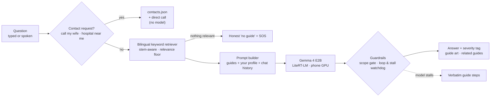

| Layer | Implementation |
|---|---|
| **LLM** | Google **Gemma 4 E2B** (`.litertlm`, 2.4 GiB) via **LiteRT-LM** `litertlm-android` 0.14.0 on the mobile GPU; falls back to Gemma 3n E2B / Gemma 3 1B INT4 if only those are present (`ModelConfig`). |
| **Grounded generation** | The model writes the answer **from the retrieved guides** and the user's profile; it may adapt them to the situation (e.g. "I saw a snake" ≠ "I was bitten"). If it stalls or loops, the app shows the guide steps verbatim. |
| **Retrieval** | Deterministic keyword retriever over tags / topic / title / body with Tagalog-aware stemming and a minimum-relevance floor. Follow-ups are retrieved together with the question that started the topic. The `Retriever` interface is a seam for embeddings. |
| **Knowledge** | 13 JSON packs in `app/src/main/assets/packs/` — **112 topics × EN+TL = 224 chunks**, each with severity, tags and a named authority (Philippine Red Cross, DOH, WHO, NDRRMC, PHIVOLCS, PAGASA, BFP, PCG…). Schema: [`docs/PACK-AUTHORING-GUIDE.md`](docs/PACK-AUTHORING-GUIDE.md). |
| **Guardrails** | Scope gate (`OFF_TOPIC` sentinel → fixed refusal), relevance floor (no match → honest "I don't know"), phone numbers only from `contacts.json`, watchdog for stalls and repetition. |
| **Data** | Profile and chat history are local JSON (`SharedPreferences` / app files). Nothing is uploaded. |
| **UI** | Kotlin + Jetpack Compose, "Photo Journal" design system, Geist font ([`docs/DESIGN-SYSTEM.md`](docs/DESIGN-SYSTEM.md)). |

## What runs locally vs what needs internet

| Runs on the phone, always (airplane mode included) | Needs internet |
|---|---|
| LLM inference (Gemma 4 E2B on GPU) | **Nothing at runtime.** The app declares **no `INTERNET` permission** (verified in the merged manifest). |
| Retrieval over the bundled guides, personalisation, guardrails | One-time setup only: downloading the model file (≈2.4 GiB) to your computer. |
| Contacts directory, GPS → area lookup (bundled coordinates), chat history, profile | |
| Illustrations, themes, search, SOS | |

Optional features that lean on Android system services, outside our app's control: **voice input** uses the phone's
speech recognizer (offline only if the device has its offline language pack; typing is always fully offline), and
the nicety of turning GPS into a place *name* may use Android's geocoder when it has a connection. Neither is
required for any core flow.

## Run it yourself (for judges)

No deployment is needed — everything is recreated from this repo.

**Prerequisites:** JDK 17, Android SDK (API 35), `adb`, and an Android phone (API 29+, USB debugging on). The model
needs a modern phone with GPU and roughly 4 GB of free RAM.

```bash
# 1. Build and install
git clone https://github.com/darljed/sagip-ai.git && cd sagip-ai
./gradlew :app:assembleDebug
adb install -r app/build/outputs/apk/debug/app-debug.apk

# 2. Get the model (too large for git): accept the Gemma terms, then download
#    gemma-4-E2B-it.litertlm from
#    https://huggingface.co/litert-community/gemma-4-E2B-it-litert-lm
./scripts/push-model.sh ~/Downloads/gemma-4-E2B-it.litertlm   # copies to /data/local/tmp/llm/gemma-4-e2b-it.litertlm

# 3. Launch SAGIP. The loading screen says "Loading Gemma 4 E2B"; the app is usable while it loads.
```

**Prove it is offline:** switch on airplane mode, then ask
*"Someone is bleeding heavily and feeling dizzy"* or *"May baha na papasok sa bahay, ano gagawin ko?"*.

**Headless checks** (debug build, no tapping):

```bash
adb shell "am broadcast -a dev.darl.sagip.DEBUG_ASK --es q 'what are my allergies and what should I avoid' -p dev.darl.sagip"
adb logcat -s SagipTest SagipGen          # answer, related guides, timing (TTFT / total)
./gradlew :app:testDebugUnitTest          # 109 JVM unit tests: data, retrieval, prompts, art coverage
```

If the model file is missing the app still works as an offline guide browser and shows the guide text directly.

## Tested on

**Samsung Galaxy S23 Ultra** (SM-S918B) · Snapdragon 8 Gen 2 (SM8550) · 12 GB RAM · Android 16 ·
Gemma 4 E2B on GPU: first token ≈ 0.7–1.8 s, a full answer in ≈ 3–10 s.

## Disclosures

| Item | Detail |
|---|---|
| **Models** | Google **Gemma 4 E2B** (runtime, on-device). Gemma 3n E2B and Gemma 3 1B INT4 are optional fallbacks that were not required for the demo. No cloud inference. |
| **Frameworks & libraries** | Kotlin 2.2.21, Jetpack Compose, **LiteRT-LM** 0.14.0, AndroidX, Gradle; Android `SpeechRecognizer`, `LocationManager`/`Geocoder`, Telecom. |
| **APIs / cloud** | None at runtime. During development: OpenRouter (image generation, below). |
| **Existing code & assets** | Open-source libraries above. Gemma weights are Google's, used under the Gemma terms. The plan and the first three seed knowledge packs (first aid, typhoon/flood, earthquake) were drafted just before the clock started (see `PLAN.md` §9); the app, the other 100+ topics, categories, contacts, tests, art and tooling were built during the hackathon — see the git history. Geist font (SIL OFL). |
| **AI-generated assets** | 121 PNG topic illustrations generated through OpenRouter (`google/gemini-2.5-flash-image` pilot, `google/gemini-3.1-flash-lite-image` bulk); only a sample was human-reviewed (see [`docs/PACK-AUTHORING-GUIDE.md`](docs/PACK-AUTHORING-GUIDE.md) §9). 13 category covers are hand-authored SVG. App icon and logo were generated with unslop.site tooling. |
| **AI development tools** | kiro-cli (Claude Sonnet) and opencode were used as coding assistants. No Devin / Cognition tooling was used. |
| **Sample data** | Makati and San Pablo area contacts are placeholders, badged **Sample** in the app; 911 and Red Cross 143 are real. Replace with official DRRMO numbers before production. |

## Safety and honest limits

- SAGIP summarises trusted public guidance; it is **not a substitute for professional medical care**, and says so on
  first launch. Critical guides point to emergency services.
- Guides cite named authorities and avoid dosages beyond their sources. Of the 121 AI-generated illustrations only a
  sample has been human-verified; some frames still have imperfect lettering (tracked in `docs/IMAGE-MANIFEST.md`).
- A 2B-parameter model can still phrase things awkwardly (we saw some stilted Tagalog). Steps come from the guides and
  the app falls back to verbatim guide text when generation fails.
- Voice input has been tested for the plumbing but not extensively with real speech.

## Repository map

```
app/src/main/
  assets/packs/            13 knowledge packs (EN+TL JSON)
  assets/illustrations/    category covers, 121 topic images, index.json
  assets/contacts.json     national + area emergency directory (samples badged)
  java/dev/darl/sagip/
    chat/                  ChatViewModel, QuickIntents, FollowUp, session store
    data/                  PackRepository, retrievers, PromptBuilder, contacts, profile
    llm/                   LiteRT-LM engine, ModelConfig, repetition guard
    ui/                    Compose shell, screens, design system
    onboarding/            profile wizard
    voice/                 speech input
app/src/test/              109 JVM unit tests
docs/                      design system, pack schema, judge briefing, screenshots, submission answers
scripts/push-model.sh      copies the model onto the phone
PLAN.md                    original plan, demo script, progress log
```

More: [`docs/JUDGE-BRIEFING.md`](docs/JUDGE-BRIEFING.md) · [`docs/SUBMISSION.md`](docs/SUBMISSION.md) ·
[`docs/CHUNK-SCHEMA.md`](docs/CHUNK-SCHEMA.md) · [`PLAN.md`](PLAN.md)

## Demo script (60 seconds)

1. **Airplane mode on**, shown on screen. No Wi-Fi, no data.
2. Ask: *"Someone is bleeding heavily and feeling dizzy."* → life-threatening tag, steps addressed to you, guide art.
3. Ask in Tagalog: *"May baha na papasok sa bahay, ano gagawin ko?"* → Tagalog steps, household-aware, "Tawagan si Maria
   para masigurado na ligtas ang pamilya".
4. Ask *"What are my allergies and what should I avoid?"* → it answers from your private profile.
5. Say *"Call my wife"* → the call is placed. Close: *when the signal is gone, the AI is still here.*

## Team

**Darl Jed Matundan** — solo · [darl.dev](https://darl.dev) · San Pablo City, Laguna, Philippines

<div align="center"><sub>Built for the AppBuildersPH Hackathon 2026 · Theme: Local AI · Demo Day at Cyberzone, SM Makati</sub></div>
